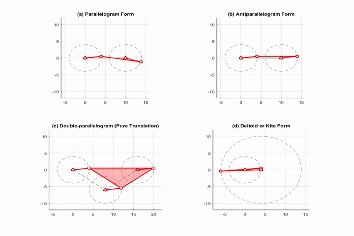

# Four-Bar Linkage Special Cases

A MATLAB simulation visualizing four classic special-case configurations of the
four-bar linkage mechanism, animated simultaneously in a 2×2 subplot layout.



## Overview

This script solves the four-bar linkage position analysis in closed form
(law of cosines / vector-loop method) and animates four well-known special
geometries side by side:

| Subplot | Configuration | Link lengths (a, b, c, d) | Notes |
|--------|----------------|------------------------------|-------|
| (a) | Parallelogram | 4, 10, 4, 10 | Open assembly mode |
| (b) | Antiparallelogram | 4, 10, 4, 10 | Crossed assembly mode |
| (c) | Double-parallelogram | 4, 4, 4 (triangle coupler) | Pure translation |
| (d) | Kite / Deltoid | 4, 10, 10, 4 | Open assembly mode |

## Method

For a given crank angle `θ2`, the position of joint B is found using:

1. Compute the diagonal distance `D` between the crank pin and the ground
   pivot `O4`.
2. Apply the law of cosines to find the internal angle `β` between the
   coupler and the diagonal.
3. Add or subtract `β` depending on assembly mode (open vs. crossed) to get
   the coupler angle `θ3`.
4. Reconstruct joint coordinates from `θ2` and `θ3`.

A small angular offset (`0.001` rad) is used to avoid singularities at
linkage change points, where links become collinear.

## Requirements

- MATLAB R2023b (should work on most recent releases; no special toolboxes required)

## Usage

```matlab
FourBarLinkage_SpecialCases.m
```

Running the script opens a figure with four animated subplots that update
simultaneously.

## Author

Aliakbar Hoveydapoyr

## License

MIT (or your choice — see LICENSE file)
